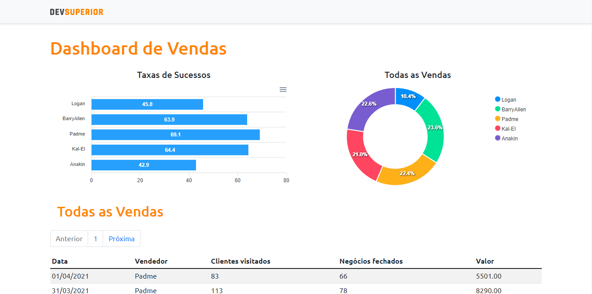
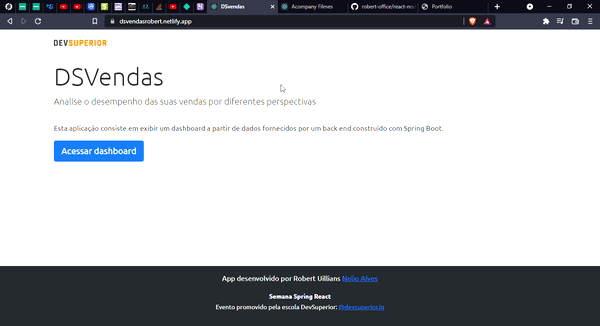

<!-- Badges session -->

  
  <!-- languages -->
  
  <!-- repo size -->
  
  <!-- last commit -->
  
  <!-- licence MIT -->
  

<!--Banner session-->

  

<!--About session-->
<h1 align="center">SDS3 - Bootcamp Semana de Desenvolvimento em SpringBoot AcompanyOn</h1>

 mMeu primeiro contato com os frameworks SpringBoot e ReactJs, como já tenho mais afinidade com PHP por ter trabalhado com a técnologia prefiro utilizar Laravel, mas percebi que os frameworks tem uma boa semelhança... 

<h3>Projeto hospedado na Netilify: [Projeto](https://dsvendasrobert.netlify.app/) </h3>

<h3>Cara do projeto</h3>

<h3>👨‍💻 Tecnologias utilizadas</h3>

- [HTML](https://www.w3schools.com/html/)
- [CSS](https://developer.mozilla.org/pt-BR/docs/Web/CSS)
- [JavaScript](https://developer.mozilla.org/en-US/docs/Web/JavaScript)
- [ReactJS](https://pt-br.reactjs.org/)
- [Typescript](https://www.typescriptlang.org/)
- [SpringBoot](https://spring.io/projects/spring-boot)

<!--License session-->
<h3>📝 Licença</h3>

- Este projeto está sob a licença [MIT](./LICENSE).

<!--Bottom session-->
 <h4 align=center>Feito por <a target="_blank" href="https://robert-office.github.io/robert-curriculum" >Robert Uillians</a></h4>
